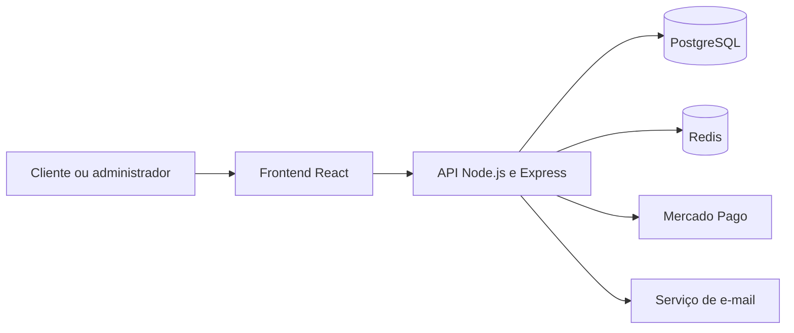

# Gestão de Casas

Plataforma full stack para centralizar a gestão de imóveis de temporada, clientes, reservas, contratos e pagamentos.

URL DA DEMONSTRAÇÃO: https://gestao-casas-frontend.onrender.com/ (Nota de homologação: Esta aplicação foi projetada seguindo o conceito Mobile-First, priorizando a experiência em dispositivos móveis. A interface adaptada para desktop está em fase de planejamento no roadmap do produto).

Acesso Cliente (Demonstração): carlos@email.com | Senha: Senha@123 Administrador (Demonstração): admin@gestaocasas.com | Senha: Senha@123

> **Projeto comercial:** este repositório é um estudo de caso público. O código-fonte completo da aplicação não está incluído.

## Visão geral

O Gestão de Casas foi desenvolvido para reunir em um único ambiente tarefas que normalmente ficam espalhadas entre planilhas, conversas e serviços diferentes. A solução oferece uma experiência pública para consulta de imóveis e reservas e uma área administrativa para a operação do negócio.

O produto atende especialmente ao mercado brasileiro: a interface está em português, os documentos seguem dados locais e os meios de pagamento foram estruturados para integração com o Mercado Pago.

## Demonstração

<!-- Substitua o endereço abaixo pela URL pública do frontend. -->

**Aplicação:** `URL DA DEMONSTRAÇÃO`

O ambiente demonstrativo utiliza dados fictícios. Operações financeiras devem permanecer em modo de demonstração ou sandbox.

> Em hospedagens gratuitas, o primeiro carregamento pode demorar enquanto o serviço é reativado.

## Principais recursos

- Catálogo responsivo de imóveis com galeria de imagens;
- Consulta de disponibilidade e criação de reservas;
- Cadastro e administração de clientes;
- Gestão de imóveis, períodos, valores e ocupações;
- Emissão de contratos a partir de modelos e dados do locador;
- Preservação histórica dos dados utilizados em cada contrato;
- Fluxos de pagamento por PIX, cartão e boleto;
- Integração-base com Mercado Pago e modo de pagamento simulado;
- Painel administrativo com indicadores financeiros e operacionais;
- Envio de comunicações por e-mail;
- Documentação interativa da API com Swagger;
- Ambiente reproduzível com Docker Compose;
- Receita de implantação para Render, PostgreSQL/Neon e Redis;
- Testes automatizados no frontend e no backend.

## Tecnologias

| Camada | Tecnologias |
| --- | --- |
| Frontend | React 19, TypeScript, Vite e Tailwind CSS |
| Backend | Node.js, Express e Sequelize |
| Dados | PostgreSQL e Redis |
| Pagamentos | Mercado Pago |
| Documentação | OpenAPI/Swagger |
| Infraestrutura | Docker, Docker Compose, Render e Neon |
| Qualidade | Testes automatizados e CI/CD |

## Arquitetura resumida

Esse diagrama é apenas uma representação provisória. A versão visual definitiva será adicionada em [`diagrams/`](diagrams/README.md).

Uma descrição mais detalhada está disponível em [Arquitetura](docs/architecture.md).

## Decisões importantes

- **Snapshot contratual:** um contrato preserva os dados utilizados no momento de sua emissão, evitando que alterações futuras no cadastro do locador modifiquem documentos históricos.
- **Proteção de dados sensíveis:** CPFs relacionados ao locador e aos snapshots contratuais são protegidos com AES-256-GCM.
- **Chave persistente:** a chave usada na criptografia contratual deve permanecer protegida e não pode ser trocada ou removida sem um processo controlado de migração.
- **Pagamento hospedado:** a aplicação não coleta diretamente número completo do cartão, validade ou CVV; esses dados devem ser tratados pelo SDK seguro do gateway.
- **Idempotência:** os fluxos de pagamento foram estruturados para reduzir duplicidades em reenvios e eventos concorrentes.
- **Configuração externa:** credenciais de banco, e-mail e pagamento são fornecidas pelo responsável pela implantação por meio de variáveis de ambiente.

Leia também:

- [Decisões de engenharia](docs/engineering-decisions.md)
- [Segurança e privacidade](docs/security.md)
- [Estratégia de implantação](docs/deployment.md)

## Capturas de tela

As imagens da aplicação serão adicionadas em [`screenshots/`](screenshots/README.md).

Sugestões para apresentação:

1. Página inicial e catálogo de imóveis;
2. Detalhes do imóvel e galeria;
3. Fluxo de reserva;
4. Painel administrativo;
5. Gestão de imóveis e uploads;
6. Gestão de clientes e reservas;
7. Configuração do locador e contratos;
8. Relatórios financeiros;
9. Documentação Swagger.

## Escopo deste repositório

Este repositório contém somente materiais públicos de portfólio:

- Apresentação do produto;
- Documentação de arquitetura;
- Decisões técnicas relevantes;
- Práticas de segurança;
- Capturas de tela e diagramas sem informações sensíveis.

Ele **não contém** o frontend, o backend, regras de negócio completas, migrations, seeds, arquivos de infraestrutura do produto ou credenciais de serviços externos.

## Autoria e direitos

Projeto desenvolvido por **Pedro Lucas**.

Todos os direitos são reservados. A disponibilização deste estudo de caso não concede permissão para copiar, redistribuir, sublicenciar, vender ou explorar comercialmente o produto demonstrado ou os materiais deste repositório.

Não há uma licença de código aberto associada a este repositório.
